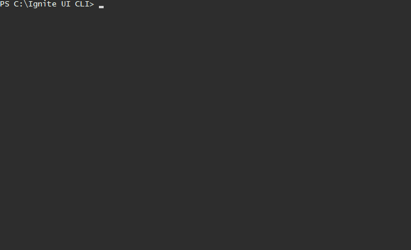

## Ignite UI CLI

<!-- Badges section here. -->

[](https://coveralls.io/github/IgniteUI/igniteui-cli)
[](https://badge.fury.io/js/igniteui-cli)
[](https://discord.gg/39MjrTRqds)

Quickly create projects including [Ignite UI for Angular](https://www.infragistics.com/products/ignite-ui-angular) and [Ignite UI for jQuery](https://www.infragistics.com/products/ignite-ui) components for a variety of frameworks.

## Overview
### Features:
- Create project structure
- Add views with Ignite UI components (e.g. Combo, Grid or Chart)
- Add scenario based templates with multiple components (e.g. a dashboard)
- Build and install npm packages
- Select a theme, support for custom themes coming soon
- Step by step guide

### Supported frameworks
 * jQuery
 * Angular
 * React

### Prerequisites
The repository houses multiple packages and orchestrates building and publishing them with [lerna](https://github.com/lerna/lerna) and [yarn workspaces](https://yarnpkg.com/lang/en/docs/workspaces/).

In order to build the repository locally, you need to have `yarn` installed on your machine.
For installation instructions, please visit their [official page](https://yarnpkg.com/lang/en/docs/install/)

### Packages
This monorepo contains several packages that combine into the `igniteui-cli`:

| Package | Description | Location |
|-----|-----|-----|
| [@igniteui/cli-core](https://www.npmjs.com/package/@igniteui/cli-core) | Contains the core functionality of the cli tool | [packages/core](./packages/core) |
| [@igniteui/angular-templates](https://www.npmjs.com/package/@igniteui/angular-templates) | Contains the template definitions for Angular components | [packages/igx-templates](./packages/igx-templates) |
| [@igniteui/angular-schematics](https://www.npmjs.com/package/@igniteui/angular-schematics) | IgniteUI CLI implementation to be used with Angular CLI's schematics engine | [packages/ng-schematics](./packages/ng-schematics) |
| [igniteui-cli](https://www.npmjs.com/package/igniteui-cli) | Standalone IgniteUI CLI tool for React, jQuery and Angular | [packages/cli](./packages/cli) |
| [@igniteui/mcp-server](https://www.npmjs.com/package/@igniteui/mcp-server) | Model Context Protocol (MCP) server for AI-assisted project creation | [packages/mcp-server](./packages/mcp-server) |

## Table of Contents

* [Installation](#installation)
* [Usage](#usage)
  * [Step by step](#step-by-step)
  * [List available commands](#list-the-available-commands)
  * [Generating Projects and adding components](#generating-projects-and-adding-components)
  	* [Generate Ignite UI for Angular project](#generate-ignite-ui-for-angular-project)
	* [Generate Ignite UI for React project](#generate-ignite-ui-for-react-project)
	* [Adding components](#adding-components)
  * [Build and run](#build-and-run)
* [Schematics](#schematics)
  * [Schematic Definitions](#schematic-definitions)
* [Contribution](#contribution)

## Installation

Install the npm package as a global module:

```bash
npm install -g igniteui-cli
```

## Usage
The main entry point is `igniteui` and is also aliased as `ig`. Both can be used interchangeably to call available commands. Check out our [Wiki documentation](https://github.com/IgniteUI/igniteui-cli/wiki) for more details.

### Step by step
To get a guided experience through the available options, simply run:

```bash
ig
```



Upon creation, project will be automatically loaded in the default browser.
**NOTE**: If that doesn't happen the port may be already in use. Ports vary for different project types, see the description for the [`ig start`](https://github.com/IgniteUI/igniteui-cli/wiki/Start) command for details on default ports.


### List the available commands.

```bash
ig help
```
### Generating projects and adding components

Create a new project passing name, framework and style theme.
```bash
ig new <project name> --framework=<framework> --type=<proj-type> --theme=<theme>
```
This will create the project and will install the needed dependencies.

Parameters besides name are optional. Framework default to "jquery", project type defaults to the first available in the framework and theme to the first available for the project. For more information visit [ig new](https://github.com/IgniteUI/igniteui-cli/wiki/New) Wiki page.

#### Generate Ignite UI for Angular project

To create a new project with Ignite UI for Angular use [ig new](https://github.com/IgniteUI/igniteui-cli/wiki/New#creating-ignite-ui-for-angular-applications) by specifying `angular` as framework, and optionally `igx-ts` as project type and selecting one of the [project templates](https://github.com/IgniteUI/igniteui-cli/wiki/New#arguments):
```bash
ig new "IG Project" --framework=angular --type=igx-ts --template=side-nav
```
#### Generate Ignite UI for React project

To create a new project with Ignite UI for React use [ig new](https://github.com/IgniteUI/igniteui-cli/wiki/New#creating-ignite-ui-for-react-applications-v400) by specifying `react` as framework and `igr-es6` as project type:
```bash
ig new "IG Project" --framework=react --type=igr-es6
```
#### Generate Ignite UI for Web Components project

To create a new project with Ignite UI for Web Components use [ig new](https://github.com/IgniteUI/igniteui-cli/wiki/New#creating-ignite-ui-for-web-components-applications) by specifying `webcomponents` as framework:
```bash
ig new "IG Project" --framework=webcomponents
```

#### Adding components
Once you have created a project, at any point you can add additional component templates using [ig add](https://github.com/IgniteUI/igniteui-cli/wiki/Add). Running the command without parameters will guide you through the available templates:

```bash
ig add
```
Add a new component or template to the project passing component ID and choosing a name.

```bash
ig add <component/template> <component_name>
```

The ID matches either a component ("grid", "combo", "text-editor", etc) or a predefined template. Predefined templates are framework/project specific and can provide predefined views with either multiple components or fulfilling a specific use case like "form-validation", "master-detail" and so on.

For full list of supported templates in the current project you can simply run [ig list](https://github.com/IgniteUI/igniteui-cli/wiki/List) command:
```bash
ig list
```

### Build and run
```bash
ig build
ig start
```

## MCP Server

The Ignite UI CLI now includes a Model Context Protocol (MCP) server that enables AI assistants like Claude to create and manage Ignite UI projects programmatically. The MCP server exposes three main tools:

1. **create_igniteui_project** - Create new projects for Angular, React, Web Components, or jQuery
2. **upgrade_to_licensed** - Upgrade projects from trial to licensed versions
3. **generate_from_docs** - Access documentation and generate component code

### Installation

```bash
npm install -g @igniteui/mcp-server
```

### Usage with Claude Desktop

Add to your Claude Desktop configuration:

**macOS**: `~/Library/Application Support/Claude/claude_desktop_config.json`
**Windows**: `%APPDATA%/Claude/claude_desktop_config.json`

```json
{
  "mcpServers": {
    "igniteui": {
      "command": "npx",
      "args": ["-y", "@igniteui/mcp-server"]
    }
  }
}
```

For more details, see the [MCP Server documentation](./packages/mcp-server/README.md).

## Schematics
You can also add `Ignite UI for Angular` components to your projects by using the `igniteui/angular-schematics` package. It included schematic definitions for most of the logic present in the [`igniteui-cli`](/packages/cli). These can be called in any existing Angular project or even when creating one. You can learn more about the schematics package on from its [readme](/package/ng-schematics).

## Contribution

See the [Contribution guide](https://github.com/IgniteUI/igniteui-cli/blob/master/.github/CONTRIBUTING.md) to get started.

### Run locally
1. Clone the repository
2. Install dependencies with `yarn install`
3. To build the packages, run `yarn build` in the project `root`.
4. Open in Visual Studio Code
    
    There is a predefined launch.config file for VS Code in the root folder, so you can use VS Code View/Debug window and choose one of the predefined actions. These include launching the step by step guide, create new project for a particular framework or add components.

5. Hit Start Debugging/F5

## Data Collection

The Ignite UI CLI tool uses Google Analytics to anonymously report feature usage statistics and basic crash reports. This data is used to help improve the Ignite UI CLI tools over time. You can opt out of analytics before any data is sent by using

```bach
ig config set disableAnalytics true -g
```

when using the CLI. You can read Infragistics privacy policy at https://www.infragistics.com/legal/privacy.

