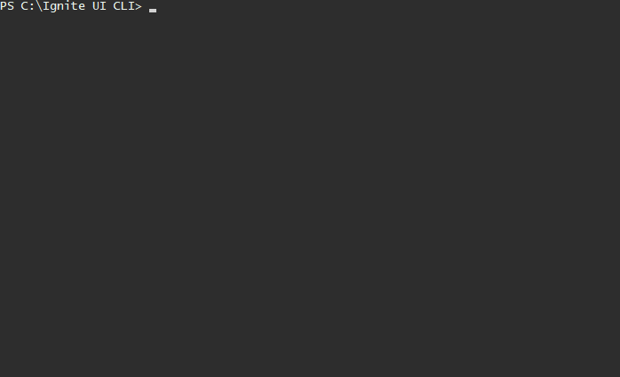

## Ignite UI CLI

<!-- Badges section here. -->

[](https://coveralls.io/github/IgniteUI/igniteui-cli)
[](https://badge.fury.io/js/igniteui-cli)
[](https://discord.gg/39MjrTRqds)

Quickly create projects including [Ignite UI for Angular](https://www.infragistics.com/products/ignite-ui-angular) and [Ignite UI for jQuery](https://www.infragistics.com/products/ignite-ui) components for a variety of frameworks.

## Overview
### Features:
- Create project structure
- Add views with Ignite UI components (e.g. Combo, Grid or Chart)
- Add scenario based templates with multiple components (e.g. a dashboard)
- Build and install npm packages
- Select a theme, support for custom themes coming soon
- Step by step guide

### Supported frameworks
 * Angular
 * React
 * Web Components
 * jQuery

### Prerequisites
The repository houses multiple packages and orchestrates building and publishing them with [lerna](https://github.com/lerna/lerna) and [yarn workspaces](https://yarnpkg.com/lang/en/docs/workspaces/).

In order to build the repository locally, you need to have `yarn` installed on your machine.
For installation instructions, please visit their [official page](https://yarnpkg.com/lang/en/docs/install/)

### Packages
This monorepo contains several packages that combine into the `igniteui-cli`:

| Package | Description | Location |
|-----|-----|-----|
| [@igniteui/cli-core](https://www.npmjs.com/package/@igniteui/cli-core) | Contains the core functionality of the cli tool | [packages/core](./packages/core) |
| [@igniteui/angular-templates](https://www.npmjs.com/package/@igniteui/angular-templates) | Contains the template definitions for Angular components | [packages/igx-templates](./packages/igx-templates) |
| [@igniteui/angular-schematics](https://www.npmjs.com/package/@igniteui/angular-schematics) | IgniteUI CLI implementation to be used with Angular CLI's schematics engine | [packages/ng-schematics](./packages/ng-schematics) |
| [igniteui-cli](https://www.npmjs.com/package/igniteui-cli) | Standalone IgniteUI CLI tool for React, jQuery and Angular | [packages/cli](./packages/cli) |
| [@igniteui/mcp-server](https://www.npmjs.com/package/@igniteui/mcp-server) | MCP server providing AI assistants with Ignite UI documentation and API reference | [packages/igniteui-mcp/igniteui-doc-mcp](./packages/igniteui-mcp/igniteui-doc-mcp) |

## Table of Contents

* [Installation](#installation)
* [Usage](#usage)
  * [Step by step](#step-by-step)
  * [List available commands](#list-the-available-commands)
  * [Generating Projects and adding components](#generating-projects-and-adding-components)
  	* [Generate Ignite UI for Angular project](#generate-ignite-ui-for-angular-project)
	* [Generate Ignite UI for React project](#generate-ignite-ui-for-react-project)
	* [Adding components](#adding-components)
  * [Build and run](#build-and-run)
* [Configure AI Tooling](#configure-ai-tooling)
* [MCP Server](#mcp-server)
  * [Using with AI Assistants](#using-with-ai-assistants)
  * [Testing with MCP Inspector](#testing-with-mcp-inspector)
* [Schematics](#schematics)
  * [Schematic Definitions](#schematic-definitions)
* [Contribution](#contribution)

## Installation

Install the npm package as a global module:

```bash
npm install -g igniteui-cli
```

## Usage
The main entry point is `igniteui` and is also aliased as `ig`. Both can be used interchangeably to call available commands. Check out our [Wiki documentation](https://github.com/IgniteUI/igniteui-cli/wiki) for more details.

### Step by step
To get a guided experience through the available options, simply run:

```bash
ig
```



Upon creation, project will be automatically loaded in the default browser.
**NOTE**: If that doesn't happen the port may be already in use. Ports vary for different project types, see the description for the [`ig start`](https://github.com/IgniteUI/igniteui-cli/wiki/Start) command for details on default ports.


### List the available commands.

```bash
ig help
```
### Generating projects and adding components

Create a new project passing name, framework and style theme.
```bash
ig new <project name> --framework=<framework> --type=<proj-type> --theme=<theme>
```
This will create the project and will install the needed dependencies.

Parameters besides name are optional. Framework defaults to "angular", project type defaults to the first available in the framework and theme to the first available for the project. For more information visit [ig new](https://github.com/IgniteUI/igniteui-cli/wiki/New) Wiki page.

#### Generate Ignite UI for Angular project

To create a new project with Ignite UI for Angular use [ig new](https://github.com/IgniteUI/igniteui-cli/wiki/New#creating-ignite-ui-for-angular-applications) by specifying `angular` as framework, and optionally `igx-ts` as project type and selecting one of the [project templates](https://github.com/IgniteUI/igniteui-cli/wiki/New#arguments):
```bash
ig new "IG Project" --framework=angular --type=igx-ts --template=side-nav
```
#### Generate Ignite UI for React project

To create a new project with Ignite UI for React use [ig new](https://github.com/IgniteUI/igniteui-cli/wiki/New#creating-ignite-ui-for-react-applications-v400) by specifying `react` as framework and `igr-ts` as project type:
```bash
ig new "IG Project" --framework=react --type=igr-ts
```
#### Generate Ignite UI for Web Components project

To create a new project with Ignite UI for Web Components use [ig new](https://github.com/IgniteUI/igniteui-cli/wiki/New#creating-ignite-ui-for-web-components-applications) by specifying `webcomponents` as framework:
```bash
ig new "IG Project" --framework=webcomponents
```

#### Adding components
Once you have created a project, at any point you can add additional component templates using [ig add](https://github.com/IgniteUI/igniteui-cli/wiki/Add). Running the command without parameters will guide you through the available templates:

```bash
ig add
```
Add a new component or template to the project passing component ID and choosing a name.

```bash
ig add <component/template> <component_name>
```

The ID matches either a component ("grid", "combo", "text-editor", etc) or a predefined template. Predefined templates are framework/project specific and can provide predefined views with either multiple components or fulfilling a specific use case like "form-validation", "master-detail" and so on.

For full list of supported templates in the current project you can simply run [ig list](https://github.com/IgniteUI/igniteui-cli/wiki/List) command:
```bash
ig list
```

### Build and run
```bash
ig build
ig start
```

## Configure AI Tooling

To configure Ignite UI AI tooling — MCP servers and AI coding skills — run:

```bash
ig ai-config
```

You will be prompted to select which AI tools to configure (Claude and Generic are selected by default). You can also pass agents directly:

```bash
ig ai-config --agents claude copilot generic
```

This creates or updates `.vscode/mcp.json` with entries for the [Ignite UI MCP](#mcp-server) and `igniteui-theming` MCP servers (existing servers are preserved), copies AI coding skill files from installed Ignite UI packages, and generates agent-specific instruction files (e.g. `CLAUDE.md`, `AGENTS.md`).

The `ig new` command also prompts for AI tool configuration as part of project creation.

## MCP Server

The CLI includes a bundled [MCP (Model Context Protocol)](https://modelcontextprotocol.io/) server that provides AI assistants with Ignite UI documentation search, API reference lookup, and scaffolding guidance for Angular, React, Blazor, and Web Components.

Start the MCP server:
```bash
ig mcp
```

The server runs over stdio and supports the following options:
```bash
ig mcp --remote <url>   # Use a remote backend instead of the local SQLite database
ig mcp --debug          # Enable debug logging to mcp-server.log
```

### Using with AI Assistants

For VS Code, the `ig ai-config` command handles configuration automatically (see above). For other MCP clients (e.g., Claude Desktop, Cursor), configure them manually:

```json
{
  "mcpServers": {
    "igniteui-cli": {
      "command": "npx",
      "args": ["-y", "igniteui-cli", "mcp"]
    },
    "igniteui-theming": {
      "command": "npx",
      "args": ["-y", "igniteui-theming", "igniteui-theming-mcp"]
    }
  }
}
```

The MCP server exposes the following tools to AI assistants:

| Tool | Description |
|------|-------------|
| `list_components` | List available Ignite UI component docs for a framework |
| `get_doc` | Fetch full markdown content of a specific component doc |
| `search_docs` | Full-text search across Ignite UI documentation |
| `get_api_reference` | Retrieve the full API reference for a component or class |
| `search_api` | Search API entries by keyword or partial component name |
| `generate_ignite_app` | Return a setup guide for a new Ignite UI project |

### Testing with MCP Inspector

To interactively test and debug the MCP server tools:
```bash
npx @modelcontextprotocol/inspector ig mcp
```

## Schematics
You can also add `Ignite UI for Angular` components to your projects by using the `igniteui/angular-schematics` package. It included schematic definitions for most of the logic present in the [`igniteui-cli`](/packages/cli). These can be called in any existing Angular project or even when creating one. You can learn more about the schematics package on from its [readme](/package/ng-schematics).

## Contribution

See the [Contribution guide](https://github.com/IgniteUI/igniteui-cli/blob/master/.github/CONTRIBUTING.md) to get started.

### Run locally
1. Clone the repository
2. Install dependencies with `yarn install`
3. Build the MCP server and bundle it into the CLI:
    ```bash
    cd packages/igniteui-mcp/igniteui-doc-mcp
    npm install
    npm run build
    cd ../../..
    npm run build:mcp
    ```
4. Build the monorepo packages: `npm run build`
5. Open in Visual Studio Code
    
    There is a predefined launch.config file for VS Code in the root folder, so you can use VS Code View/Debug window and choose one of the predefined actions. These include launching the step by step guide, create new project for a particular framework or add components.

6. Hit Start Debugging/F5

#### MCP Server development

The MCP server at `packages/igniteui-mcp/igniteui-doc-mcp` has its own build pipeline, separate from the monorepo. It uses ESM (ES2022, Node16 modules) while the rest of the monorepo uses CommonJS. See [DEVELOPMENT.md](./packages/igniteui-mcp/igniteui-doc-mcp/DEVELOPMENT.md) for the full MCP server development guide.

**Build the MCP server:**
```bash
cd packages/igniteui-mcp/igniteui-doc-mcp
npm install          # Install MCP-specific dependencies (separate from yarn workspaces)
npm run build        # Compile TypeScript + copy SQLite DB to dist/
```

**Build API reference documentation:**

The MCP server includes API reference docs for Angular, React, and Web Components. Angular and Web Components docs are generated from framework submodules via TypeDoc (submodules are auto-initialized by the build scripts). React uses a pre-built TypeDoc JSON model checked into git.

```bash
cd packages/igniteui-mcp/igniteui-doc-mcp
npm run build:docs:angular         # Angular: init submodule → TypeDoc → markdown + index.json
npm run build:docs:webcomponents   # Web Components: init submodule → build lib → TypeDoc → markdown + index.json
npm run build:docs:all             # Build both
```

> **Note:** Web Components requires a one-time library build (`npm run build:publish` in the submodule) before TypeDoc can run. The build script handles this automatically.

**Build MCP server** (from the repo root):
```bash
npm run build:mcp    # Compiles MCP server TypeScript and copies SQLite DB into dist/
```

**Test the MCP server locally:**
```bash
npm run build:mcp
npm run build
node packages/cli/lib/cli.js mcp          # Start via CLI
# or directly:
node packages/cli/mcp/dist/index.js       # Start the bundled server
```

#### Building CLI package with bundled MCP server

The CLI package includes the MCP server as a bundled build artifact (not an npm dependency). To produce a complete CLI package with full MCP functionality, follow these steps:

```bash
# 1. Install monorepo dependencies
yarn install

# 2. Build the MCP server
cd packages/igniteui-mcp/igniteui-doc-mcp
npm install
npm run build                              # Compile TypeScript + copy SQLite DB

# 3. Build API reference docs (optional but recommended for full functionality)
npm run build:docs:all                     # Init submodules + generate Angular + WC API docs via TypeDoc

# 4. Bundle MCP into CLI (from repo root)
cd ../../..
npm run build:mcp                      # Build MCP server

# 5. Build all packages for publishing
npm run build-pack
```

After step 5, `npm pack` from the repo root or `packages/cli/` will produce a tarball with the MCP server, documentation database, and API reference docs all included.

> **Skipping API docs:** If you skip step 3, the MCP server will still work for `list_components`, `get_doc`, `search_docs`, and `generate_ignite_app` tools using the bundled SQLite database. Only the `get_api_reference` and `search_api` tools require API docs.

## Data Collection

The Ignite UI CLI tool uses Google Analytics to anonymously report feature usage statistics and basic crash reports. This data is used to help improve the Ignite UI CLI tools over time. You can opt out of analytics before any data is sent by using

```bach
ig config set disableAnalytics true -g
```

when using the CLI. You can read Infragistics privacy policy at https://www.infragistics.com/legal/privacy.

